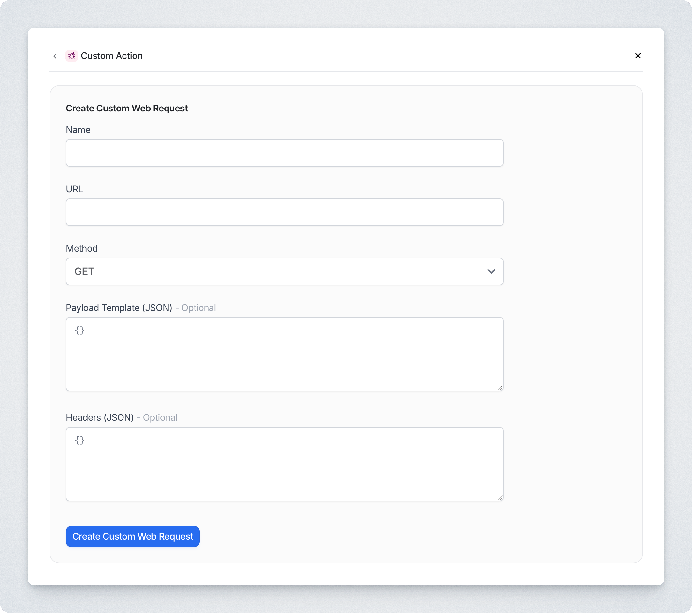

# Custom Actions/APIs


Only available on **custom plan**. Please contact support to enable this.


## What is Custom Action?

The Custom Action tool allows you to define custom web requests for the bot to use.

<figure><figcaption><p>Preview of custom action tool (subject to change)</p></figcaption></figure>

<table><thead><tr><th width="277.11328125">Fields</th><th>Description</th></tr></thead><tbody><tr><td>Name</td><td>Name of your custom action. This will determine how the action can be called inside of your custom prompt. The name will be automatically converted to <code>custom_api_&#x3C;name></code>.</td></tr><tr><td>URL</td><td><p>Endpoint you want to make a request to. Query parameters are supported.<br><br>Example:</p><pre class="language-url"><code class="lang-url">https://your-domain.com/path?q={{param}}
</code></pre></td></tr><tr><td>Payload Template <em>(Optional)</em></td><td><p>Request body to be sent to the endpoint. Can be empty.<br><br>Example:</p><pre class="language-json"><code class="lang-json">{
  "fieldName": "value",
  "anotherField": "{{param2}}" // this can be passed in by the AI by configuring the prompt
}
</code></pre></td></tr><tr><td>Headers <em>(Optional)</em></td><td>Request headers to be sent to the endpoint. Can be empty.</td></tr></tbody></table>

***

## How to use?

You can use the tool just like any other existing tools. Refer to the following guide for more information.




You can have multiple instances of custom action.


In the sidebar, click on **Customize** to open up the customize fly-out.

<figure><figcaption></figcaption></figure>

In the fly-out, click on **Create new action**.

<figure><figcaption></figcaption></figure>

Then look for **Custom Action**.

<figure><figcaption></figcaption></figure>

Finally, define your custom web request and hit **Create Custom Web Request**. Once created, custom action will appear under **Actions**.

<figure><figcaption></figcaption></figure>



In order to use the tool, you can invoke it just like how you would with any of the other existing tools.

For example, to retrieve the last n results from an endpoint, we can add the following prompt.

```
Invoke `custom_api_get_posts` to get the last 5 posts' <titles> and <ids>.
```

Afterwards, we can tell the bot to respond with the retrieved values.

```
Reply with the following in markdown:
  <a bulleted list of <ids> and <titles>>
```


